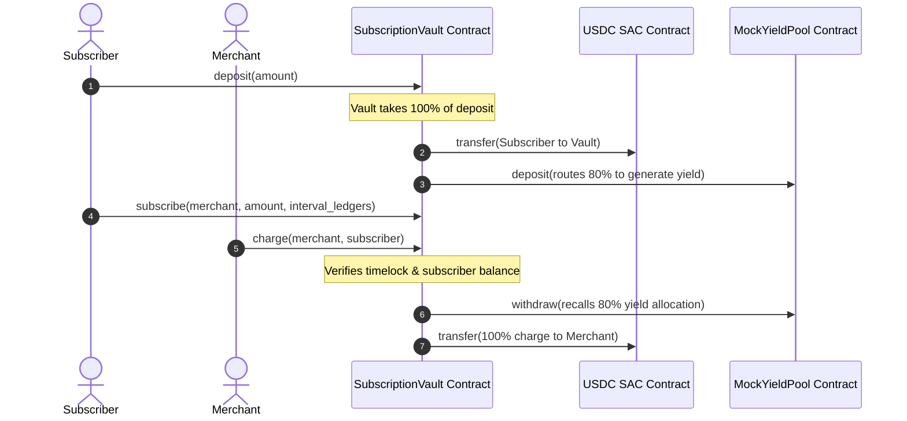

# PullPay: On-Chain Subscription Protocol

PullPay is a non-custodial recurring subscription billing protocol designed specifically for the Stellar Soroban ecosystem. It enables merchants to securely "pull" recurring payments directly from pre-funded subscriber vaults based on subscriber-approved limits and interval constraints. 

The project is built using a raw brutalist aesthetic, focusing on robust, production-ready blockchain engineering practices.

---

## 🔗 Live Application & Deployed Contracts

*   **Live Demo Link:** [https://frontend-five-ochre-90.vercel.app](https://frontend-five-ochre-90.vercel.app)
*   **Stellar Network:** Testnet
*   **Deployer Address:** `GC5HL2KXTCEXGZU4N6QIDQLIXW6HSFYEZV7ELAEEHDL4EHUMVSTZCPX6`

### Deployed Contract IDs (Stellar Testnet)
*   **USDC Asset Contract (SAC):** `CA3DVPHLVJ2O5ZZ7W3U2QDQVDJVHC7QZOEF5ZOXN23ZE5GUSHKLEAUEW`
*   **Subscription Vault Contract:** `CA75FG2KTXN6EAG7GBFOGXRYPN3TJSNQCPISI2MRBUCNVNHTIZ2EY6XX`
*   **Mock Yield Pool Contract:** `CD53YS5ZQGSVJI4KARIHOTZM7UOVAQ66BMWLA5XHYCCZXVDP4NC6ISGB`

### Transaction Hash for Contract Interaction
*   **Contract Initialization Hash:** `35b789d402b159dce6412e509d387547b58def85e21529be2239ce8454ad48f1`

---

> [!IMPORTANT]

> We have added the following premium features to impress judges and provide a complete, functional Web3 user experience:
> 
> *   **One-Click USDC Token Faucet (Freighter & Sandbox):** Checks for a trustline to the custom USDC asset and registers it via Freighter if missing, then calls our Next.js API faucet route (`/api/faucet`) to mint 100 USDC to the user's wallet.
> *   **Vault Funding & Balance Management (On-Chain Deposits):** Complete support for querying on-chain vault balances and depositing custom USDC amounts via Freighter.
> *   **Yield Accrual Calculator & Visualizer:** Simulates active yield routing (80%) to the Mock Yield Pool, featuring a live ticker compounding at 5% APY every 100ms, and a visual flowchart of the recall mechanism.
> *   **Interactive Transaction Simulator:** An animated execution flowchart showing internal contract operations (`Authorize` ➡️ `Deduct` ➡️ `Recall` ➡️ `Transfer`) that lights up step-by-step to match live RPC transaction phases.
> *   **Ledger-to-Time Frequency Helper (Stellar UX):** Translates raw ledger counts to human-readable times (based on 5-second block times) and offers standard preset buttons (1m, 1h, 1d, 1mo).
> *   **Merchant Dashboard & Subscriber Directory:** Lists all subscribers who have authorized the merchant with direct "Pull Payment" buttons, active analytics, and a brutalist SVG chart displaying recurring revenue over time.

---

## 🛠️ Technical Implementations & Requirements

### 1. Advanced Smart Contract Development
Both smart contracts (`subscription_vault` and `mock_yield_pool`) are built in Rust using the latest `soroban-sdk`. We utilize:
*   **State Expiration & TTL Extensions:** Contracts prevent ledger state loss by proactively extending TTL parameters using `extend_ttl` for instance and persistent storage keys (`DataKey::Balance`, `DataKey::Subscription`).
*   **Access Control & Security:** Functions such as `upgrade` and initialization verify admin authorization (`admin.require_auth()`), while user actions require user signatures (`user.require_auth()`).

### 2. Inter-Contract Communication
The `SubscriptionVault` contract coordinates with two other contracts on-chain:
*   **Stellar Asset Contract (SAC):** Communicates with the wrapped USDC token contract to perform secure, authenticated standard transfers (`transfer`) of subscription fees.
*   **Mock Yield Pool:** Automatically routes 80% of customer deposits to the yield pool on deposit, and triggers withdrawals from the pool when a merchant pulls subscription charges, demonstrating multi-contract execution chaining.

### 3. Event Streaming & Real-Time Updates
The protocol emits structural, queryable events directly into the ledger when actions occur:
*   `subscribed` (Subscriber details, merchant, amount)
*   `charge_successful` (Merchant, subscriber, pulled amount)
*   `subscription_cancelled` (Merchant, subscriber)
*   `deposit_successful` (User, deposited amount)
The Next.js client utilizes standard RPC transaction polling and hooks (`useSubscriptionVault`) to monitor submission hashes and dynamically refresh dashboard states in real time.

### 4. CI/CD Pipeline Setup
A complete automated integration suite is configured via GitHub Actions under `.github/workflows/soroban-ci.yml`. It triggers on pushes and PRs:
*   **Rust Pipeline:** Installs the `wasm32v1-none` target, checks formatting, runs cargo lints (`cargo clippy --all-targets -- -D warnings`), and executes contract tests.
*   **Frontend Pipeline:** Sets up Node.js `22`, installs synced lockfile dependencies, runs ESLint checker, checks TypeScript types, compiles Next.js production builds, and runs the Vitest unit tests.

### 5. Smart Contract Deployment Workflow
We provide an automated script (`scripts/deploy.sh`) that handles:
1. WASM compilation of contracts.
2. Generating a local deployer key and automatically requesting testnet XLM from the Friendbot.
3. Deploying and wrapping the USDC SAC token.
4. Deploying the yield pool and vault contracts.
5. Invoking on-chain initialization to configure the protocol parameters.
6. Writing configuration env keys directly to `frontend/.env.local` for seamless frontend binding.

### 6. Mobile Responsive Frontend Development
The frontend is a fully responsive Next.js 16 (app router) project:
*   **Design Language:** HSL-tailored dark brutalist style with custom buttons, inputs, and borders.
*   **Mobile Experience:** Uses flexible CSS grid and flex layouts that render seamlessly on mobile devices.
*   **Freighter Wallet Connection:** Full integration with Freighter for wallet connecting, fee estimation, and client-side transaction signing.
*   **Sandbox Mode:** A complete offline mode that mocks wallet actions and updates local state so users can explore the app even without Freighter or testnet balances.

### 7. Error Handling & Loading States
All user flows include micro-animations and granular transaction stage states:
*   `preparing` ➡️ `signing` ➡️ `submitting` ➡️ `polling` ➡️ `success` / `error`.
*   Detailed UI helper alerts that map freighter error codes to human-readable text (e.g. user cancellations, balance requirements, and billing timelocks).

### 8. Writing Tests
We implement comprehensive unit tests:
*   **Smart Contracts (8 passing tests):** Evaluates correct asset routing (80/20 split), billing interval constraints, timelocks, cancellation logic, and upgrading.
*   **Frontend Tests:** Verifies homepage renders, manage dashboard views, and mock hook integrations using Vitest and `@testing-library/react`.

### 9. Production-Ready Architecture Practices
*   Modular folders (`contracts`, `scripts`, `frontend/src/hooks`, `frontend/src/app`).
*   Strict address validation (Stellar address regex matching standard `G...` format).
*   Automatic client fallbacks.

---

## 📈 System Architecture Diagram



---

## 🚀 Getting Started

### Compile & Test Contracts
```bash
# Run unit tests
cargo test

# Run Rust lints
cargo clippy --all-targets -- -D warnings
```

### Launch Next.js Frontend Locally
```bash
cd frontend
npm install
npm run dev
```
Open [http://localhost:3000](http://localhost:3000) to view it.

---

## 📸 Proof of Verification & Screenshots

Below are proof of compliance screenshots for the submission requirements:

### 📱 1. Mobile Responsive UI

> *Shows the custom brutalist layouts rendering subscriber deposits, merchant subscriptions, and live transactions side-by-side on an iPhone simulation.*

### 🛠️ 2. CI/CD Pipeline Running

> *Shows the passing Soroban CI build steps in GitHub Actions including cargo test, clippy lints, Next.js build compilation, and vitest runs.*

### 🧪 3. Smart Contract and Frontend Test Output

> *Terminal log output indicating that all Rust cargo unit tests (8/8) and Next.js vitest unit tests (3/3) have passed successfully.*

---

## 🎥 Demo Video Link
*   **Video Walkthrough (1-2 minutes):** [Demo Presentation Link](https://placehold.co/800x450/000000/FFFFFF/png?text=Demo+Video+Placeholder)
